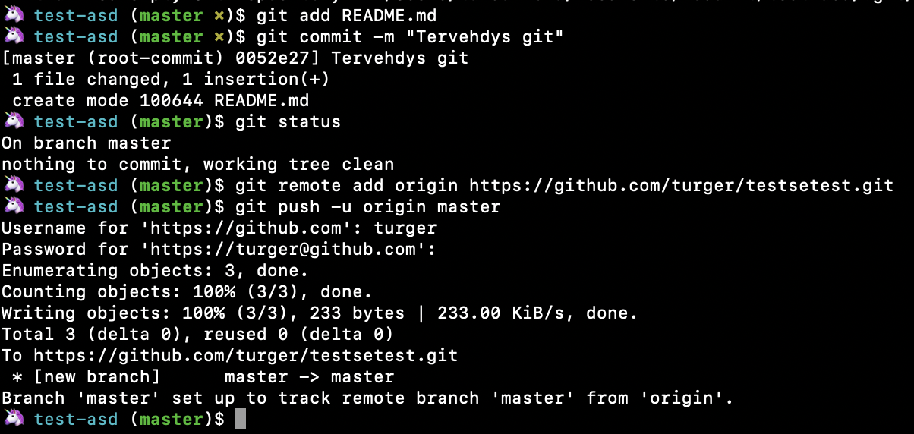

# React-harjoitus: Sää-appi ☀️
Kodarit black belt -kurssin react-harjoitus.
React.js + git + Weather API + GitHub pages.

Kurssilla on tarkoitus tehdä oma sää-appin.
Näillä eväillä voi sitten tehdä minkä vaan palvelun nettiin kohtuullisen helposti.

## Oppitunnit

Tunnit eivät ole kiveen hakattuja, voi edetä hitaammin tai nopeammin.

Koodin ohessa voidaan puhua myös sisennysten tärkeydestä.

Jos pitää jakaa jokin urli tai muu kurja copypastettava, niin voidaan perustaa kertakäyttöinen chat oppitunnin ajaksi käyttämällä esim. http://disposablechat.com tai jakaa koodia pastebinilla https://pastebin.com.

⚠️ Huom! Tämän repon commitit on pilkottu pieniin osiin järjestyksessä, jota voi seurata oppitunneilla.

# Alkuvalmistelut
Asennetaan:
- Git https://git-scm.com/
- Node.js + npm https://nodejs.org/en/download
- npx `npm install -g npx`
- Atom tai joku muu hyvä ja kevyt editori

# 1. Gitin käyttö
Käydään Macilla Terminaalilla tai Windowsilla git-bashilla yleiset komentorivikehotteet läpi: `cd`, `ls`, `pwd`, `mkdir` jne.

Asennetaan Git koneelle jos sitä ei jo löydy.
Tehdään gittiin tunnarit ja kaikille omat public-repot projektia varten. Tätä varten kaikilla täytyy olla oma sähköpostiosoite. Julkinen repository siksi, että voimme GitHubin ilmaisversiossa julkaista sivun Github pagesin avulla (ohjeet myöhempänä).

Lisätään gittiin tavaraa:
1. Tee tietokoneen hakemistoon oma kansio Kodarit-projektille.
2. Terminaalissa mene luomaasi hakemistoon `cd`-komennolla. Esim. `cd Documents/kodarit`. Tarkista että olet oikeassa paikassa komennolla `pwd`, joka tulostaa sijaintisi.
3. Kirjoita terminaaliin `git init` alustaaksesi luomasi kansio git-repoksi.
4. Tee kansioon tiedosto `README.md` omalla viestilläsi. Käytä komentoa `echo "Tämä on readme" > README.md`. Hipsujen väliin voit laittaa oman viestisi.
5. Kirjoita terminaaliin `git add README.md` lisätäksesi tiedoston gittiin meneväksi.
6. Kirjoita terminaaliin `git commit -m "Tervehdys git"` tai jokin muu commit-viesti hipsujen sisään. Tästä komennosta pitäisi tulla ilmoitus että käyttäjää ei ole määritelty, joten määritellään se seuraavaksi.
7. Määritä käyttäjänimi: `git config user.name "Nimimerkkisi"`. HUOM! Tee komento ILMAN `--global`-valintaa, ettei git-käyttäjä asetu vahingossa koko tietokoneelle yleisesti käytettäväksi. Tarkista että nimi on asetettu oikein komennolla `git config user.name`. Määritä sähköposti samalla komennolla käyttämällä `user.name` sijaan `user.email`.
8. Kirjaudu GitHubiin https://github.com/login
9. Luo uusi repository klikkaamalla oikealta ylhäältä `+`-nappia ja sen alta `new repository`.
10. Keksi repolle nimi ja tee siitä public eli julkinen. Muita kenttiä ei tarvitse käyttää, klikkaa `Create repository`.
11. Tämän jälkeen käytä https-urlia (ei siis gitistä löytyviä ohjeita, jotka ohjaavat ssh:n käyttöön)
    `git remote add origin https://github.com/username/new_repo`
    - Voit tämän jälkeen tarkistaa että hakemiston config-tiedostossa `.git/config` lukee `[core]` osaston alla https://username@bitbucket.org sen sijaan että siellä olisi malli git@bitbucket.org. Aja komento `cat .git/config` joka tulostaa tiedoston komentoriville tarkastettavaksi.
12. Lopuksi puske tiedosto Github-repositorioon:
    `git push -u origin master`
    Tämän jälkeen sinun pitää syöttää käyttäjätunnuksesi ja salasanasi.

Komentorivillä pitäisi nyt näyttää jotakuinkin tältä:


13. Tarkista lopuksi että koodisi näkyy myös Githubin repossa selaimella katsottaessa.

(Käytetään https-urleja https://help.github.com/en/articles/which-remote-url-should-i-use)

Aina ennen oppituntia ja oppitunnin jälkeen tehdään git-rituaalit ohjeiden mukaisesti. Ohjekuva löytyy tämän repon juuresta `git-flow.png`.

# 2. Asennukset ja HTML + js kertaus
Käydään ensin lyhyesti läpi yleistasolla mitä ovat GitHub pages, React.js, Weather API ja git.
- Terminaalissa mene projektisi hakemistoon `cd`-komennolla.
- Avataan Atomilla `atom index.html` ja kirjoitetaan html loppuun siellä.
- Lisätään reactia `index.html`:n sekaan.
- Avataan sivu selaimella ja ihastellaan tulosta `open index.html`.
- Lue lisää staattisen html-sivun tekemisestä: https://reactjs.org/docs/add-react-to-a-website.html.

# 3. Create-react-app
Edelliskerran harjoitus oli pikainen raapaisu reactiin, nyt aloitetaan varsinainen koodaus.
Skipataan kehitysympäristön käsin konfigurointi ja käytetään Facebookin luomaa `create-react-app` npm-kirjastoa.

Luodaan uusi react-sovellus:  
`npx create-react-app weather-app` (haluamasi sovelluksen nimi, voi olla mitä vain)  

Siirrytään luomamme sovelluksen hakemistoon:  
`cd weather-app`

Käynnistetään sovellus:  
`npm start`

- Käydään läpi mitä missäkin sovelluksen hakemistossa ja tiedostossa on sisällä ja mitä ne tekee.  
- Muokataan `src/App.js`-tiedostoa ja katsotaan miltä se näyttää selaimella.
- Päivitetään `README.md`omat tekstit.
- Vaihdetaan public/favicon.ico omavalintaiseksi kuvaksi. Esim: https://favicon.io/emoji-favicons/
- Päivitä testi.
- Poista service worker, koska sitä ei tarvita tässä projektissa.

# 4. Tehdään sää-komponentti
Luodaan `src/Weather.js`.
Tehdään sinne ensin paikka tämänhetkiselle lämpötilalle ylös keskelle.
Tehdään sen alle kovakoodattu taulukko viikonpäivistä ma-pe ja lämpötiloista 3 tunnin välein. Nämä korvataan myöhemmin oikealla säädatalla.

# 5. Lisätään css
Poistetaan `src/App.css` tiedostosta kaikki muut muotoilut paitsi `.App` ja `.App-header`. Sitten luodaan otsikolle uudet muotoilut.
Voidaan lisätä otsikolle joku kiva fontti Google fontseista https://fonts.google.com/ (mutta ei käytetä fontin valintaan liikaa aikaa). Lisätään ohjeiden mukaan fontin import-rivi `public/index.html`-tiedostoon `<head>` tagin sisään, käynnistetään appi uudestaan ja sen jälkeen fonttia voi käyttää otsikossa ja muualla appissa.
Voidaan lisätä esimerkiksi taustakuva ja eri värejä. Muokataan myös `src/App.css` halutunlaiseksi.

Luodaan `src/Weather.css` ja tehdään haluttu muotoilu Weather-komponentille.  

Esimerkeissä on käytetty flexboxia, joka on oikein mainio väline sivuston elementtien asetteluun halutuille paikoille. Tutustumisen avuksi on suositeltavaa pelata ensin Flexbox Froggy -harjoituspeliä https://flexboxfroggy.com, jonka jälkeen voidaan harjoitella omalla sivulla aikataulu-komponentin taulun sijoittamista sivun keskelle.

# 6. Tehdään kyselyt Weather-APIin
Haetaan Weather-APIsta Helsingin 5pv / 3h sää-data ja korvataan kovakoodattu sää-data tällä.  
API-kuvaus: https://openweathermap.org/forecast5.
Esimerkkikysely Helsingin sää-datan hakemiseen 5 päivän ajalle `http://api.openweathermap.org/data/2.5/forecast?id=658225&APPID=${API_KEY}&units=metric&lang=fi` City ID Helsinki on 658225 ja API keyn saa opelta.

Tässä kohtaa käydään läpi mikä on reactin state ja componentDidMount. Tallennetaan sää-data stateen.

Lisätään sää-ikonit datan mukaiseksi `http://openweathermap.org/img/wn/${weather.icon}.png`


# 7. Päivitetään näkymää kerran minuutissa ja muokataan data luettavaksi

Parsitaan datetime apufunktioilla ihmisluettavaan muotoon.  

Päivitetään näkymä kerran tunnissa.

# 8. Valitun sää-näkymän vaihto

Klikkaamalla pientä sää-kuvaketta se vaihtuu `Weather_selected`-divin sisään isoksi. Voidaan lisätä tähän isompaan näkymään lisää tietoja datasta, kuten kuvausteksti tai tuulen nopeus ja suunta.

Lisätään sivulle tieto sijainnista `city.name` ja esimerkiksi auringon nousu- ja laskuajat.

Lisätään muotoiluja näille.

# 8. GitHub pages hosting

Julkaistaan oma appi GitHub pagesin avulla.

* Lisätään api key. Mene Githubin repositoryssa `Settings`-tabin alle ja sieltä `Secrets`. Lisää uusi secret `REACT_APP_KEY`. Huom! Tämä avain ei tule olemaan oikeasti salainen github-pagesissa, sillä se tulee näkyviin `gh-pages`-branchiin ja network-tabille. Tämä johtuu siitä, että react on puhtaasti front-end framework, eikä osaa säilyttää mitään piilossa. Eli ei laiteta tänne mitään oikeasti salaista.

* Lisää kirjasto nimeltä `gh-pages` projektiin ajamalla terminaalissa projektin hakemiston sisällä komento `npm install gh-pages`.  
Tämä kirjasto auttaa meitä luomaan gittiin oman branchin nimeltä `gh-pages`, joka tarjoilee niputetut reactin tiedostot branchin kautta.  

* Lisää `package.json`-tiedostoon nimen ja version alle rivi `"homepage": "https://<käyttäjänimi>.github.io/<repositoryn-nimi>"` eli esimerkiksi `"homepage": "https://turger.github.io/react-homma"`.  

* Lisää `package.json`-tiedostoon skripti-osion sisään rivit:  
```
"predeploy": "yarn run build",
"deploy": "gh-pages -d build"
```

* Terminaalissa aja komento `npm run deploy`. Tämä komento puskee buildatut projektin tiedostot `gh-pages`-branchiin GitHubin etäpalvelimelle.  

* Lisää GitHubin käyttöliittymästä repositoryn asetuksista `GitHub Pages` -> `Source` ja valitse alasvetovalikosta valinta `gh-pages branch`.  
Tähän valikkoon pitäisi nyt tulla vihreä teksti "Your site is published at https://turger.github.io/react-homma/" (omalla urlillasi toki). Tarkista toimiiko sivu.  

Kun teet muutoksia ohjelmaasi, muista ajaa uusiksi komento `npm run deploy`, jotta muutokset menevät myös julkaistuille sivuillesi.

(Ohjeita esim. https://medium.com/the-andela-way/how-to-deploy-your-react-application-to-github-pages-in-less-than-5-minutes-8c5f665a2d2a)

# 9. TODO jos jää aikaa

- Sään voi hakea tekstikenttään kirjoittamalla kaupungin nimen.
- Sään voi hakea nykyisen sijainnin perusteella.
- Tallennetaan aina viimeksi haettu paikannimi localstorageen ja käytetään sitä sivun latautuessa.
- Sää kartassa.
- Lisätään myös css-muotoiluja niin että tausta vaihtuu aina sään mukaisen väriseksi gradientiksi tms.
